# Sugamai — Unified Health Insurance Management Platform

> Simplifying health insurance for every Indian citizen. 🏥

**Sugamai** is a standards-compliant (NHCX/FHIR R4), elder-friendly, AI-powered health insurance aggregator and compliance-claims platform. It lets citizens manage government and private health policies, find empanelled hospitals, and file, track, and get compliance-checked insurance claims — all from one place.

This README walks through every screen in the app with screenshots, then covers architecture, setup, and API reference.

---

## Table of Contents

- [Screenshots — App Walkthrough](#screenshots--app-walkthrough)
- [Architecture](#architecture)
- [Quick Start](#quick-start)
- [Features](#features)
- [API Endpoints](#api-endpoints)
- [Security](#security)
- [Testing](#testing)
- [External API Integration](#external-api-integration)

---

## Screenshots — App Walkthrough

All screenshots below were captured from a live local run, logged in as the seeded demo user **Ramesh Kumar** (an elder, SwasthID `SWA2025TEST0001`, 2 policies totalling ₹15L coverage).

### 1. Login — Aadhaar OTP

Login uses Aadhaar-based OTP (SHA-256 hashed, never stored raw). In local/sandbox mode, any 12-digit number is accepted and any 6-digit OTP verifies — no real UIDAI or SMS calls are made.

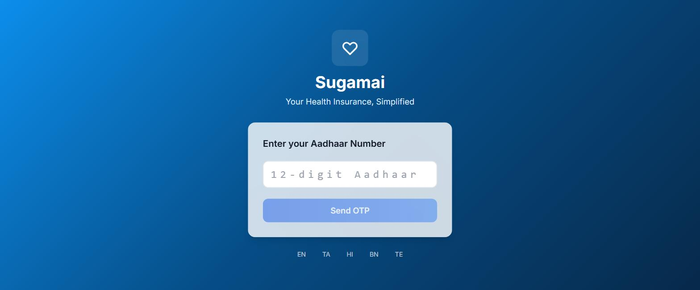

### 2. Login — OTP Verification

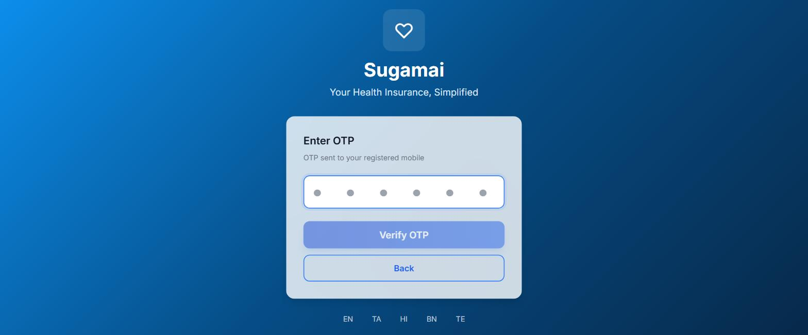

### 3. Dashboard

Landing screen after login: total coverage across all policies, active policy count, pending claims, quick actions, and recent claims.

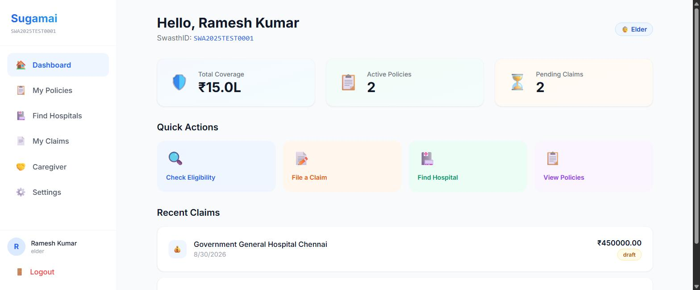

### 4. My Policies

Shows all linked policies (government + private), with one-click PMJAY (Ayushman Bharat) eligibility checking that auto-registers the policy if eligible.

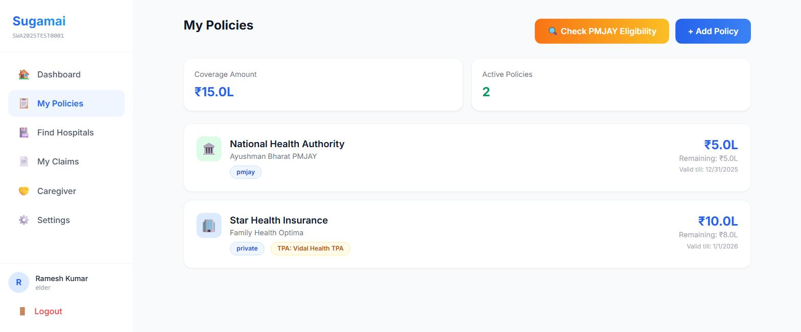

### 5. Find Hospitals

Searchable, filterable directory of empanelled hospitals with speciality tags, empanelment type (cashless / reimbursement / both), and per-hospital coverage lookup.

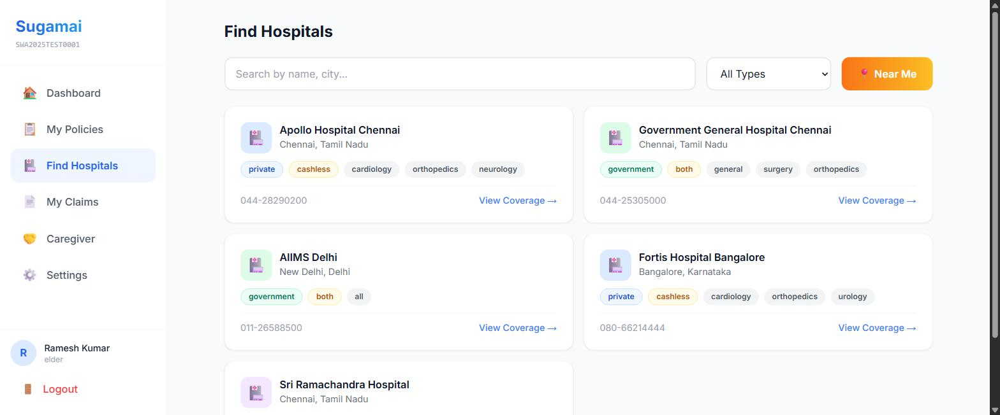

### 6. My Claims

All claims for the logged-in user with status badges (draft, submitted, processing, settled, rejected).

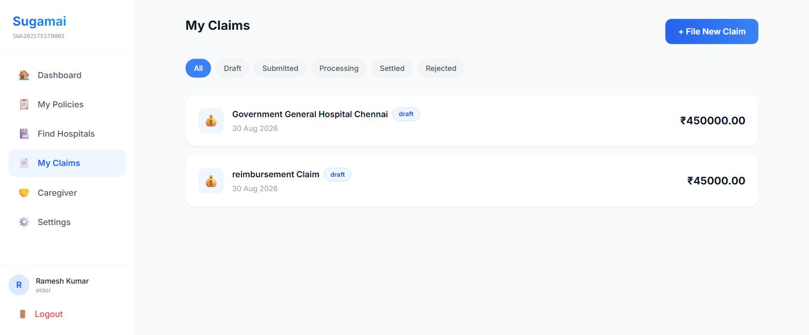

### 7. File a New Claim

Reimbursement claim intake: select policy, optionally select the treating hospital, admission/discharge dates, and claimed amount.

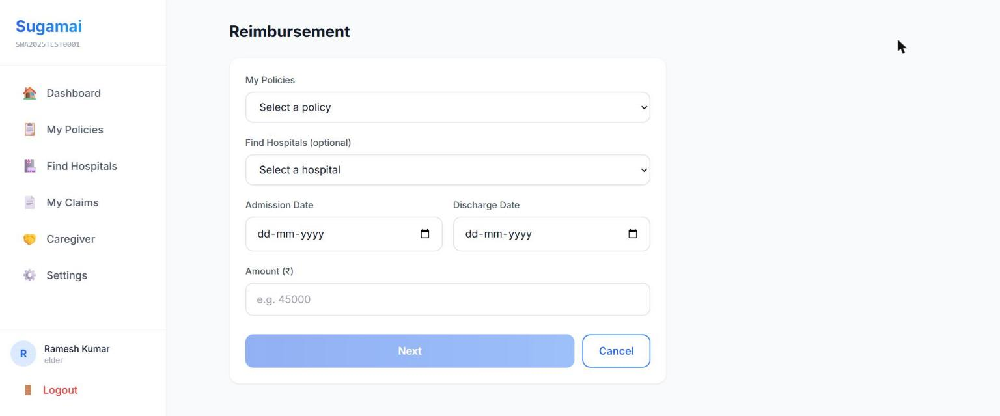

### 8. Claim Detail — AI Bill Parsing (OCR)

After filing, upload the hospital bill and discharge summary, then run AI-assisted OCR extraction to pull structured line items (room rent, surgery charges, medicines, lab tests, consultations) straight off the bill.

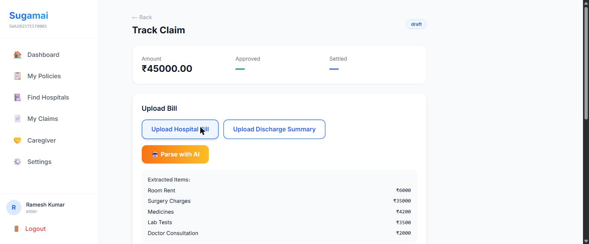

### 9. Claim Detail — Compliance Gap Check

Before a claim can be submitted to NHCX, the AI compliance engine checks for missing required documents and flags them — this is the core "compliance claim" gate that stops incomplete claims from going out.

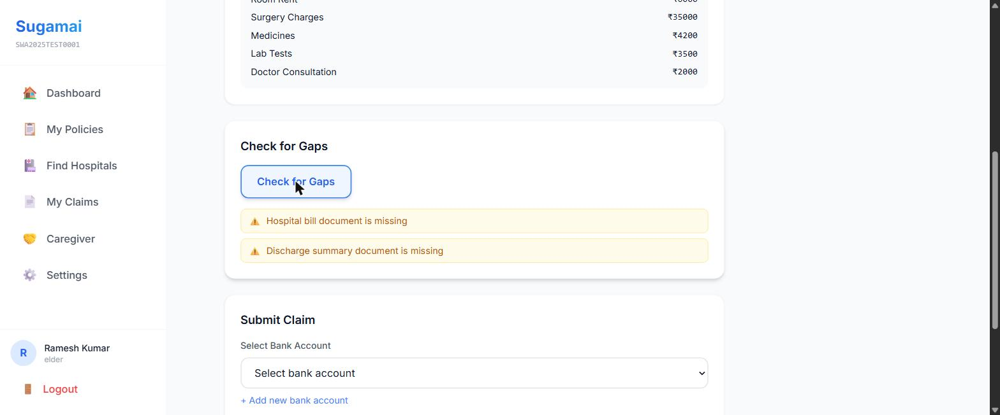

### 10. Caregiver

Elders (60+) can invite a family member as a caregiver with read-only oversight and an OTP-gated consent flow for any write actions taken on their behalf.

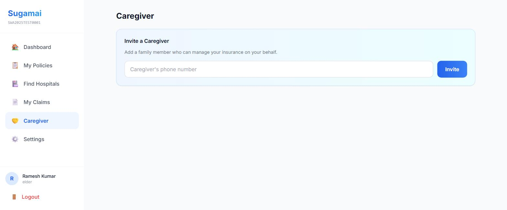

### 11. Settings

Profile details (SwasthID, ABHA, role) plus accessibility controls — large text mode, high contrast mode, and voice navigation — built for elderly users.

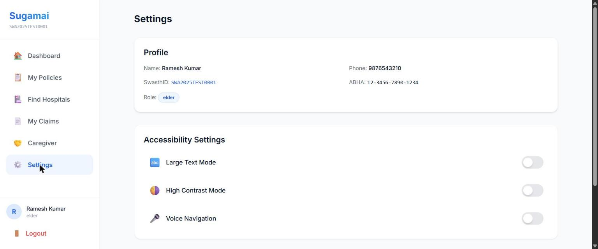

---

## Architecture

| Layer | Technology | Port |
|-------|-----------|------|
| **Backend API** | Python 3.11 + FastAPI | 8000 |
| **Frontend Web** | Next.js 14 + Tailwind CSS | 3001 (host) → 3000 (container) |
| **Frontend Mobile** | React Native + Expo | 8081 |
| **Database** | PostgreSQL 15 | 5432 |
| **Cache / Queue** | Redis 7 | 6379 |
| **File Storage** | MinIO (S3-compatible) | 9000 / 9001 |
| **Task Queue** | Celery + Redis | — |
| **Reverse Proxy** | Nginx | 80 |

### Folder Structure

```
sugamai/
├── backend/
│   ├── app/
│   │   ├── core/          # Database, redis, security, dependencies, MinIO, exceptions
│   │   ├── models/        # SQLAlchemy models (8 tables)
│   │   ├── schemas/       # Pydantic request/response schemas
│   │   ├── routers/       # API endpoints (9 routers, ~60 endpoints)
│   │   ├── services/      # Business logic + external API integrations (11 services)
│   │   ├── tasks/         # Celery async tasks (NHCX polling, OCR, notifications)
│   │   └── utils/         # JWE, FHIR, ICD codes, pagination
│   ├── alembic/           # Database migrations
│   ├── tests/             # Pytest test suites
│   ├── main.py            # FastAPI entry point
│   ├── config.py          # Pydantic settings
│   └── seed.py            # Sample data population
├── frontend-web/
│   └── src/
│       ├── app/[locale]/  # Next.js pages with i18n routing
│       │   ├── login/                    # Aadhaar OTP login
│       │   └── (dashboard)/
│       │       ├── dashboard/            # Home
│       │       ├── policies/             # Policy list + PMJAY check
│       │       ├── hospitals/            # Hospital finder
│       │       ├── claims/               # Claims list
│       │       ├── claims/new/           # File a claim
│       │       ├── claims/[id]/          # Claim detail — upload, OCR, gap check, submit
│       │       ├── caregiver/            # Caregiver invite/dashboard
│       │       └── settings/             # Profile + accessibility
│       ├── lib/           # API client (Axios + JWT interceptors)
│       ├── stores/        # Zustand state management (auth persisted to localStorage)
│       └── messages/      # i18n translations (5 languages)
├── frontend-mobile/
│   ├── app/               # Expo Router screens
│   └── lib/               # i18n config
├── docs/
│   └── screenshots/       # Screenshots used in this README
├── infra/
│   └── nginx.conf         # Reverse proxy config
└── docker-compose.yml     # Full-stack orchestration
```

## Quick Start

### Prerequisites
- Docker & Docker Compose
- Node.js 20+ (for frontend dev outside Docker)
- Python 3.11+ (for backend dev outside Docker)

### 1. Clone and configure

```bash
cp .env.example .env
# Edit .env with your API keys (optional — sandbox mocks work by default)
```

> **Note:** when running via `docker-compose`, `DATABASE_URL`, `REDIS_URL`, and `MINIO_ENDPOINT` in `.env` must point at the Docker service names (`postgres`, `redis`, `minio`), not `localhost` — the compose file's `frontend-web` service also needs `WATCHPACK_POLLING=true` set for file-watching to work reliably from a Windows host bind mount.

### 2. Start with Docker Compose

```bash
docker-compose up -d --build
```

This starts PostgreSQL, Redis, MinIO, Backend, Celery, Celery Beat, and the Frontend.

### 3. Seed the database

```bash
docker-compose exec backend python seed.py
```

This creates 5 sample empanelled hospitals and a demo elder user (**Ramesh Kumar**, Aadhaar `123456789012`) with a PMJAY policy and a private Star Health policy.

Log in with Aadhaar `123456789012` and any 6-digit OTP to use the seeded demo account.

### 4. Development (without Docker)

```bash
# Backend
cd backend
pip install -r requirements.txt
uvicorn main:app --reload --port 8000

# Frontend Web
cd frontend-web
npm install && npm run dev

# Frontend Mobile
cd frontend-mobile
npm install && npx expo start
```

## Features

### 🔐 Authentication
- Aadhaar-based OTP login (SHA-256 hashed — no raw storage)
- JWT tokens (30m access / 7d refresh)
- Role-based access control (User, Elder, Caregiver, Admin)

### 🆔 Identity (ABHA)
- Create/link ABHA health ID via ABDM sandbox
- PHR consent management

### 📋 Policy Management
- PMJAY eligibility auto-check via NHA API
- Private/employer policy registration
- Coverage tracking

### 🏥 Hospital Finder
- Location-based search with geo-distance
- Per-service coverage grid (cashless/sub-limit/not covered)
- AI-generated coverage summaries
- Pre-admission checklists

### 📄 Claims
- **Pre-authorization** → NHCX submission → approval polling
- **Cashless claims** → hospital admission → discharge → final bill
- **Reimbursement** → bill upload → OCR → AI parsing → submission
- AI gap detection before submission (the compliance gate)
- Real-time status tracking with timeline
- Bank account management with penny drop verification

### 🤖 AI Features 
- OCR bill parsing (Tesseract + Claude vision)
- Eligibility scoring across 8+ government schemes
- Coverage grid summaries in 5 languages
- Rejection code explanation with remediation steps
- Conversational eligibility chatbot

### 🤝 Caregiver
- Elder invites family member (max 2)
- Read-only dashboard for caregiver
- OTP consent flow for write actions
- Full audit trail

### ♿ Accessibility
- Large text mode
- High contrast mode
- Voice navigation (Web Speech API)
- 5 languages (English, Tamil, Hindi, Bengali, Telugu)

## API Endpoints

| Module | Prefix | Endpoints |
|--------|--------|-----------|
| Auth | `/api/v1/auth` | Aadhaar OTP, refresh, logout |
| Identity | `/api/v1/identity` | ABHA create/link/profile |
| Policies | `/api/v1/policies` | CRUD, PMJAY check, eligibility |
| Hospitals | `/api/v1/hospitals` | List, detail, coverage, NHCX check |
| Claims | `/api/v1/claims` | Pre-auth, cashless, reimbursement, OCR, FHIR, gaps, submit |
| Caregiver | `/api/v1/caregiver` | Invite, accept, elders, consent actions |
| AI | `/api/v1/ai` | Chat, coverage summary, rejection, bills, checklists |
| Admin | `/api/v1/admin` | Users, claims, audit logs, hospitals |
| Bank | `/api/v1/bank-accounts` | Add, list, delete (penny drop) |

## Security

- **Aadhaar:** SHA-256 hashed, never stored raw
- **Bank accounts:** AES-256 CFB encrypted at rest
- **NHCX payloads:** JWE encrypted (RSA-OAEP + A256GCM)
- **JWT:** Short-lived access (30m) + refresh (7d) with blacklisting
- **Rate limiting:** slowapi integration
- **CORS:** Restricted to known origins

## Testing

```bash
cd backend
pytest tests/ -v
```

## External API Integration

All integrations have **sandbox mock fallbacks** for local development — the app is fully usable with zero API keys configured:

| Service | API | Sandbox URL |
|---------|-----|-------------|
| UIDAI (Aadhaar) | OTP auth + eKYC | stage1.uidai.gov.in |
| ABDM (ABHA) | Health ID | sandbox.abdm.gov.in |
| NHCX | Claims exchange | dev.hcxprotocol.io |
| NHA (PMJAY) | Eligibility | pmjay.gov.in |
| Google Maps | Hospital search | maps.googleapis.com |
| Anthropic | AI features | api.anthropic.com |
| Twilio | SMS/OTP | api.twilio.com |
| Razorpay | Bank verification | api.razorpay.com |

## License

MIT
